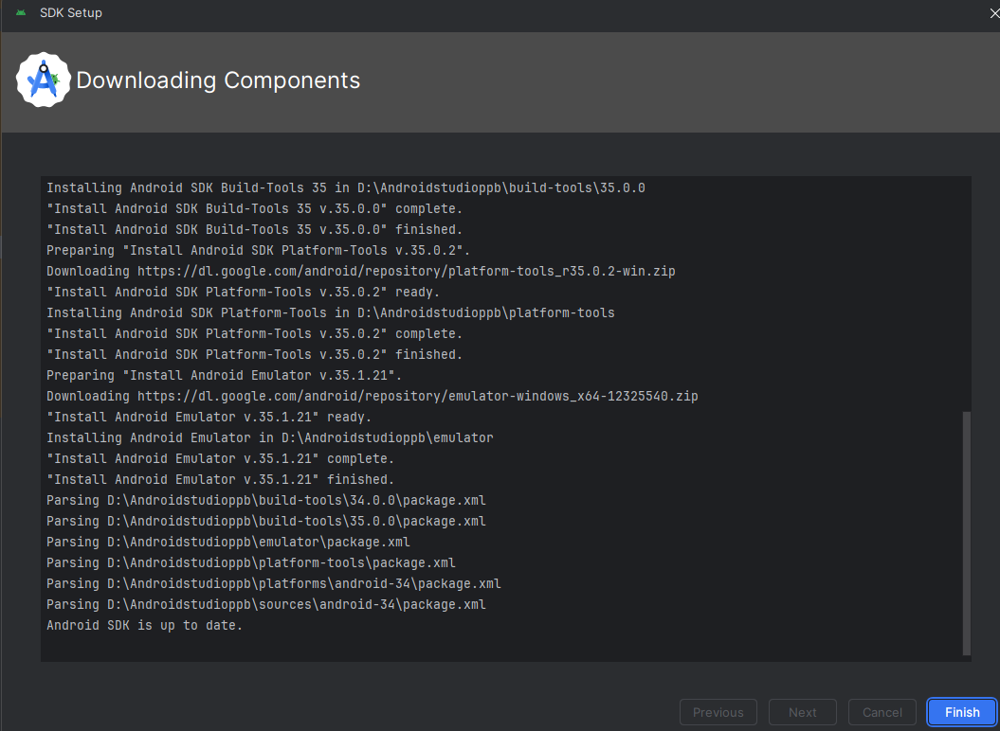
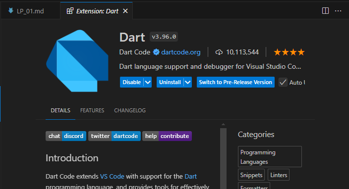

# MODUL 1. RUNNING MODUL
----
## Git
Tampilan versi git yang telah terinstal

## Instalasi JDK
Tampilan jdk saat di ENV

Tampilan lokasi instalasi JDK saat di CMD

## Instalasi Flutter SDK
Tampilan Flutter saat di ENV

Instal componen Flutter

## Instalasi Android Studio
Tampilan instalasi Android Studio

Tampilan Android Studio saat dijalankan

## Instalasi SDK Android

## Instalasi Visual Studio Code
Viseual StudioCode yang digunakan

## Instalasi Extension Visual Studio Code
1. Dart

2. Flutter
