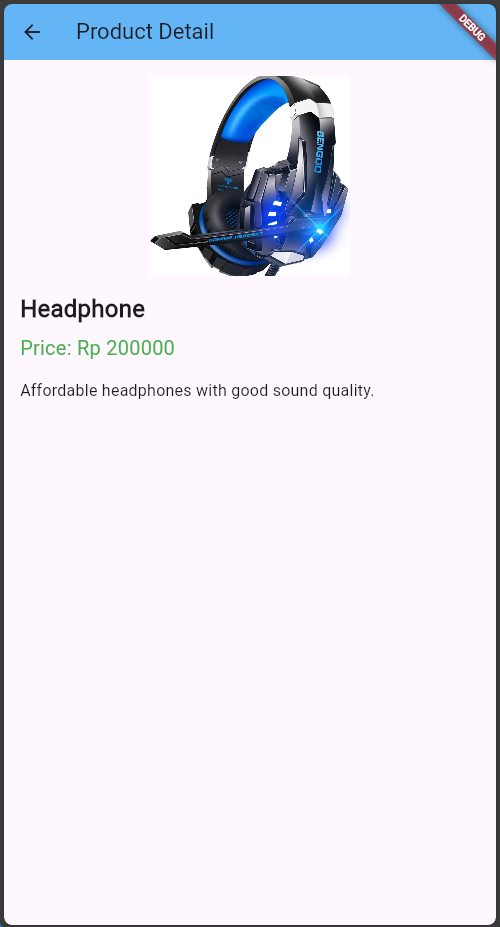

Penjelasan Guided
Aplikasi ini dibangun dengan empat bagian utama, yang masing-masing punya tugasnya sendiri-sendiri. Di file main.dart, ada pengaturan awal aplikasi dengan MaterialApp sebagai kerangka utama. Aplikasi dimulai lewat runApp() dan langsung menampilkan halaman Mypage, tempat daftar produk ditampilkan.

Nah, di mypage.dart, kita punya daftar produk yang dibuat dengan ListView.builder. Tiap produk ditampilkan sebagai ListTile, yang bisa diklik. Kalau item diklik, aplikasi akan membuka halaman detail produk dengan Navigator.push. Di sini, ListView.builder mempermudah menampilkan produk secara dinamis.

Di file detail.dart, kita punya halaman detail produk yang sederhana. Hanya ada teks di tengah layar yang menyebutkan ini halaman detail produk. File ini lebih berfungsi sebagai placeholder yang bisa dikembangkan lagi nantinya.

Terakhir, product.dart adalah model data untuk produk. Ada beberapa properti kayak id, nama, harga, imageUrl, dan deskripsi, yang bikin data produk lebih mudah dikelola. Selain itu, ada Product.fromJson untuk konversi data JSON ke objek Product, jadi sangat berguna kalau datanya diambil dari sumber eksternal.

Halaman ini adalah halaman utama yang menampilkan daftar produk, yaitu Mouse, Keyboard, dan Headphone. Masing-masing item dalam daftar menampilkan gambar, nama produk, dan harga. Ketika pengguna mengetuk salah satu produk, aplikasi akan menavigasi ke halaman detail produk tersebut.
Komponen Utama:
ListView.builder: Membuat daftar produk secara dinamis.
_buildProductCard: Fungsi ini bertanggung jawab membuat tampilan kartu untuk setiap produk menggunakan ListTile dan Card.
Navigator.push: Menangani navigasi untuk berpindah ke halaman detail produk saat item diklik.

Menampilkan detail produk Mouse, seperti nama produk, harga, dan deskripsi. Ini merupakan halaman yang ditampilkan saat pengguna mengetuk produk "Mouse" di halaman utama.
Komponen Utama:
Scaffold: Struktur dasar halaman detail, termasuk AppBar dan body.
AppBar: Menampilkan judul "Detail Product" di bagian atas halaman.
Center dan Text: Menampilkan teks sederhana untuk menunjukkan bahwa ini adalah halaman detail Mouse.

Sama seperti halaman detail Mouse, halaman ini juga menampilkan informasi tentang produk Keyboard. Saat pengguna mengetuk produk "Keyboard" di halaman utama, halaman ini akan terbuka dan menampilkan nama, harga, dan deskripsi produk Keyboard.
Komponen Utama: Sama seperti di halaman detail Mouse, menggunakan Scaffold, AppBar, Center, dan Text untuk menyusun elemen-elemen dasar.
Keterangan Tambahan: Informasi yang ditampilkan pada halaman ini adalah untuk Keyboard, tetapi strukturnya mirip dengan halaman Mouse.

Halaman ini menampilkan detail dari produk Headphone. Ketika pengguna mengetuk produk "Headphone" di halaman utama, halaman ini akan terbuka dan menampilkan informasi tentang Headphone, seperti nama produk, harga, dan deskripsi.
Komponen Utama: Menggunakan struktur yang sama seperti halaman detail Mouse dan Keyboard (Scaffold, AppBar, Center, Text).
Keterangan Tambahan: Tampilan halaman ini identik dengan dua halaman detail lainnya, tetapi informasi di dalamnya disesuaikan untuk produk Headphone.