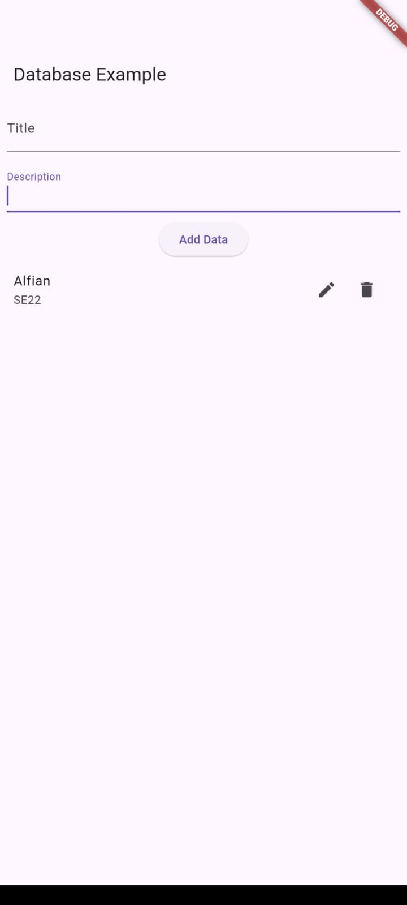

Hasil RUN Guided dan Unguided:
,       

Penjelasan Singkat:  

Kode di atas adalah implementasi sebuah aplikasi Flutter sederhana yang digunakan untuk menyimpan, menampilkan, dan mengelola data Biodata Mahasiswa menggunakan database SQLite.  
Aplikasi ini dibuat untuk:

Menyimpan data mahasiswa (nama, NIM, alamat, hobi) ke dalam database lokal (SQLite).
Menampilkan daftar mahasiswa yang telah disimpan.
Memungkinkan pengguna untuk menambahkan data mahasiswa baru.
Menggunakan konsep Model-View-Helper (MVH) untuk struktur kode yang rapi.  

Pada bagian helper/db_helper.dart, terdapat fungsi untuk mengelola database seperti membuat tabel (_onCreate()), menambahkan data (insert()), membaca semua data (queryAllRows()), memperbarui data (update()), dan menghapus data (delete()). Semua operasi ini dilakukan melalui class DatabaseHelper.  

model/mahasiswa_model.dart mendefinisikan struktur data mahasiswa melalui class Mahasiswa, dengan fungsi toMap() untuk mengubah data menjadi format map agar bisa disimpan ke database.  

view/main_view.dart adalah halaman utama yang menampilkan daftar mahasiswa menggunakan ListView.builder. Halaman ini juga memiliki tombol tambah (FloatingActionButton) untuk menuju form input data mahasiswa.  

view/add_mahasiswa_view.dart menyediakan form input untuk menambah data mahasiswa baru. Data yang diinput akan disimpan ke database melalui fungsi addMahasiswa() dan halaman utama akan diperbarui menggunakan refreshData().  